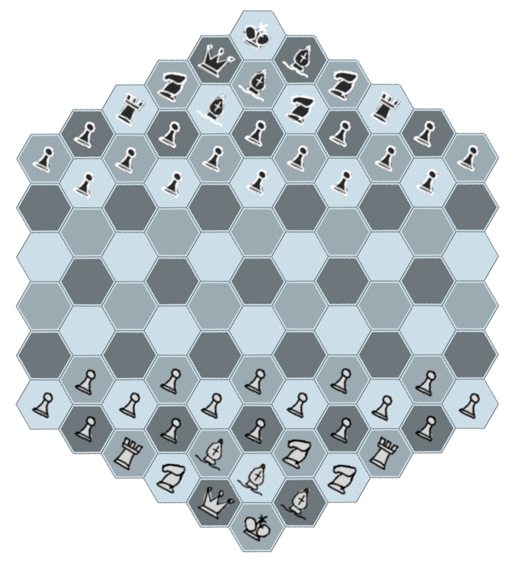
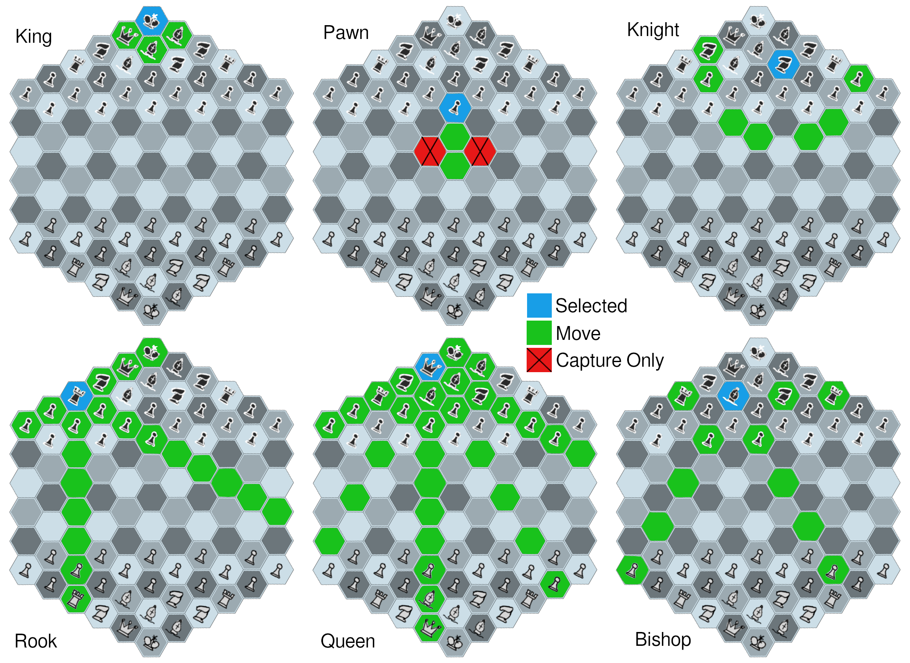

## Project Design
### Board:
Instead of a regular square tiled chess board this game will use a hexagonal tiled board. This will affect the game logic and initial setup slightly. But design choices will be made in order to attempt to preserve most of the game-play of the original. The most notable differences being:

1. There are 3 tile colors, this requires 3 bishops.
2. Diagonals jump a tile, since hexagons share a side with all adjacent hexagons (unlike squares which share a vertex, but not a side, with 4 of their neighbors). Here I am defining diagonals as tiles that are not along a rank or file. For both square and hexagonal boards, diagonals have the same tile color.
3. Hexagonal tiles actually have 3 “ranks” while square tiles have 2 (named ranks for rows and files for columns).
4. Due to the increased freedom of movement, the hexagonal board had to be scaled up significantly to preserve the feel of the original game, 91 tiles instead of 64.
5. Due to the diagonal skipping, and the difficulty of building a pawn chain, the number of pawns was doubled.

*Proposed initial setup; note that there are 3 bishops, 3 knights, and 16 pawns for each player.*
### Pieces:

- King
  - Captures by movement
  - Moves one tile in any direction
  - Cannot move into check
  - Cannot castle if in check or passes through a tile under threat
- Queen
  - Captures by movement
  - Move any number of squares along a rank, file, or diagonal
- Rook
  - Captures by movement
  - Move any number of squares along a rank or file
  - Can be castled with King if both pieces have not moved, there are no obstructions, and the King does not pass through a threatened space.
- Knight
  - Moves to any of the closest squares that are not on the same rank, file, or diagonal
  - Captures by movement
- Bishop
  - Diagonal Movement
  - Captures by movement
- Pawn
  - Moves forward 1 space
  - Captures diagonally
  - Moves 1-2 on first movement
  - Other pawns can capture a pawn that moved 2 tiles on the previous round as if it moved 1 tile that round.
  - On advancement to last rank, the pawn is promoted to a Queen, Rook, Bishop, or Knight.

*Some moves in the figure above are blocked by other pieces, but were included to illustrate the selected piece’s full moveset.*
